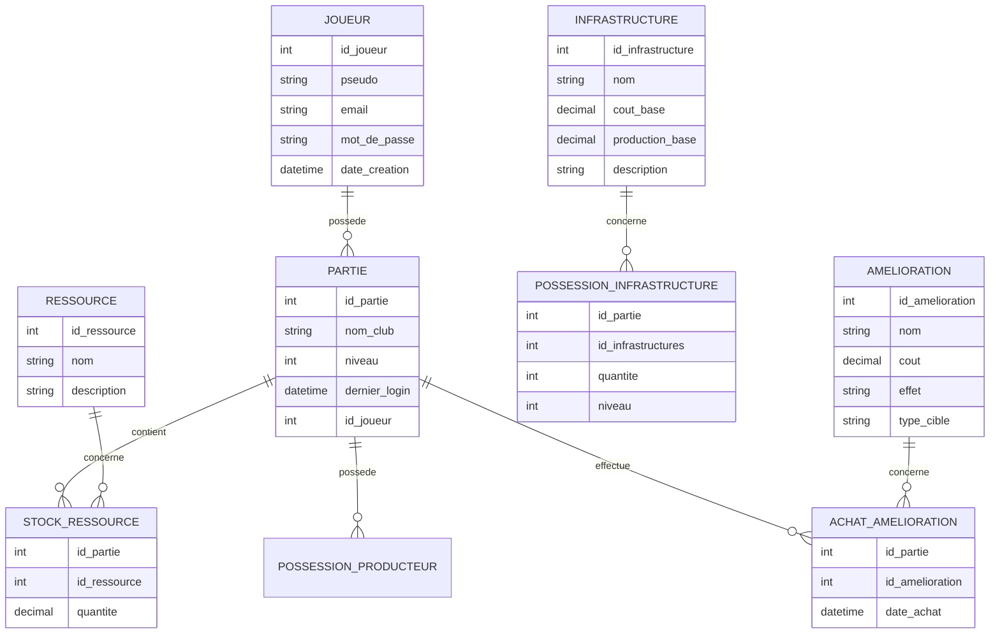

# Projet fil rouge – Jeu vidéo idle Rugby

## 1. Concept de jeu

J'ai choisi de développer un **jeu web de type idle game / cookie clicker** dans un univers **rugby**. Le joueur incarne un manager de club de rugby et doit faire progresser son équipe et ses infrastructures grâce à des actions manuelles (clics) et des revenus passifs générés automatiquement.

Les mécaniques principales sont :
- Accumulation de ressources (par exemple : argent, fans, prestige).
- Achat d' **infrastructures** (stade, centre d’entraînement, boutique, etc) qui génèrent des ressources de façon passive.
- Achat d’**améliorations** qui augmentent la production, réduisent les coûts ou débloquent de nouveaux bonus.
- Progression d’un **club** sur plusieurs niveaux, avec sauvegarde de la partie pour chaque joueur.

---

## 2. Stack technique

### 2.1. Front-end

- **Framework** : React
- **Rôle** : gérer l’interface utilisateur, l’affichage en temps réel des ressources, infrastructures, améliorations et boutons d’action (clics, achats, etc.).
- **Justification** : React est adapté aux interfaces dynamiques avec beaucoup de mises à jour d’état (ressources qui augmentent, achats, effets). Il favorise une bonne séparation en composants et une bonne maintenabilité du code.

### 2.2. Back-end

- **Technologies** : Node.js + Express
- **Rôle** :
  - Exposer une **API REST** pour gérer l’authentification, le chargement et la sauvegarde des parties, les achats et la progression.
  - Centraliser la logique métier (validation des actions, calcul des gains, vérification des coûts).
- **Justification** : Node.js/Express permet de construire rapidement une API REST simple, scalable, avec une bonne intégration avec un front JavaScript.

### 2.3. Base de données

- **SGBD** : PostgreSQL
- **Rôle** :
  - Stocker les données persistantes : joueurs, parties, ressources, infrastructures, améliorations, achats, progression.
- **Justification** : PostgreSQL est très adapté à un modèle **relationnel** avec des entités clairement identifiées (JOUEUR, PARTIE, RESSOURCE, INFRASTRUCTURES, AMELIORATION…). Il garantit l’intégrité référentielle et la cohérence des données.

### 2.4. Outils de modélisation et documentation

- **Mermaid** pour réaliser les diagrammes (MLD, schémas d’architecture).
- **Mocodo** pour réaliser lesdiagramme MCD.

---

## 3. Architecture globale

### 3.1. Description générale

L’architecture retenue est une architecture **client–serveur** classique avec les composants suivants :

- **Client web (Front React)**  
  - Affiche l’interface du jeu (score, ressources, infrastructures, améliorations).
  - Envoie les actions du joueur (clics, achats, sauvegarde, chargement) via des requêtes HTTP vers l’API.

- **API REST (Back Node.js / Express)**  
  - Expose des endpoints du type :
    - `POST /auth/register`, `POST /auth/login`
    - `GET /parties`, `POST /parties`
    - `GET /parties/:id`, `PUT /parties/:id`
    - `POST /parties/:id/acheter-infrastructures`
    - `POST /parties/:id/acheter-amelioration`
  - Implémente les règles métier :
    - Vérification des ressources disponibles avant un achat.
    - Mise à jour des quantités et niveaux de infrastructures.
    - Calcul des ressources générées entre deux connexions (à partir de `dernier_login`).

- **Base de données PostgreSQL**  
  - Stocke :
    - Les comptes joueurs.
    - Les parties (un joueur peut avoir plusieurs parties).
    - Le référentiel des ressources, infrastructures et améliorations.
    - L’état de progression de chaque partie.

### 3.2. Schéma d’architecture

- Le **client React** envoie une requête HTTP à l’**API Express** lorsqu’un joueur se connecte, charge une partie ou effectue une action (achat, clic majeur, etc.).
- L’API Express applique la logique métier, puis lit / met à jour les données dans **PostgreSQL**.
- Les réponses de l’API sont renvoyées au front, qui met à jour l’interface en conséquence.
- Les actions importantes (création de compte, création de partie, achats, progression) sont toujours persistées côté serveur afin d’éviter la triche côté client.

Cette architecture répond aux attentes du sujet : interactions client/serveur, API REST, base de données, et cohérence front/back.

---

## 4. Modélisation des données

### 4.1. MCD (Modèle Conceptuel de Données)

Principales **entités** :

- **Joueur**
  - id_joueur
  - pseudo
  - email
  - mot_de_passe
  - date_creation

- **Partie**
  - id_partie
  - nom_club
  - niveau
  - dernier_login
  - id_joueur

- **Ressource**
  - id_ressource
  - nom
  - description

- **StockRessource**
  - id_partie
  - id_ressource
  - quantite

- **Infrastructure**
  - id_infrastructure
  - nom
  - cout_base
  - production_base
  - description

- **PossessionInfrastructure**
  - id_partie
  - id_infrastructure
  - quantite
  - niveau

- **Amelioration**
  - id_amelioration
  - nom
  - cout
  - effet
  - type_cible

- **AchatAmelioration**
  - id_partie
  - id_amelioration
  - date_achat

Principales **relations** :

- Un **Joueur** possède une ou plusieurs **Parties**.
- Une **Partie** possède un stock de plusieurs **Ressources**.
- Une **Partie** possède plusieurs **Infrastructures** (via PossessionInfrastructure).
- Une **Partie** peut acheter plusieurs **Ameliorations** (via AchatAmelioration).


Ce MCD sépare :
- Les **référentiels du jeu** (Ressource, Infrastructure, Amelioration).
- Les **données de progression** du joueur (StockRessource, PossessionInfrastructure, AchatAmelioration).

### 4.2. Diagramme MCD en Mermaid



---

## 5. MLD (Modèle Logique de Données)

Transformé en tables relationnelles, le MLD devient :

- **JOUEUR**(
  id_joueur PK,  
  pseudo,  
  email UNIQUE,  
  mot_de_passe,  
  date_creation  
  )

- **PARTIE**(
  id_partie PK,  
  nom_club,  
  niveau,  
  dernier_login,  
  id_joueur FK -> JOUEUR.id_joueur  
  )

- **RESSOURCE**(
  id_ressource PK,  
  nom,  
  description  
  )

- **STOCK_RESSOURCE**(
  id_partie FK -> PARTIE.id_partie,  
  id_ressource FK -> RESSOURCE.id_ressource,  
  quantite,  
  PK(id_partie, id_ressource)  
  )

- **INFRASTRUCTURE**(
  id_infrastructure PK,  
  nom,  
  cout_base,  
  production_base,  
  description  
  )

- **POSSESSION_INFRASTRUCTURE**(
  id_partie FK -> PARTIE.id_partie,  
  id_infrastructure FK -> INFRASTRUCTURE.id_infrastructure,  
  quantite,  
  niveau,  
  PK(id_partie, id_infrastructure)  
  )

- **AMELIORATION**(
  id_amelioration PK,  
  nom,  
  cout,  
  effet,  
  type_cible  
  )

- **ACHAT_AMELIORATION**(
  id_partie FK -> PARTIE.id_partie,  
  id_amelioration FK -> AMELIORATION.id_amelioration,  
  date_achat,  
  PK(id_partie, id_amelioration)  
  )

---

## 6. Script SQL de création

```sql
CREATE TABLE joueur (
    id_joueur SERIAL PRIMARY KEY,
    pseudo VARCHAR(50) NOT NULL,
    email VARCHAR(100) NOT NULL UNIQUE,
    mot_de_passe VARCHAR(255) NOT NULL,
    date_creation TIMESTAMP DEFAULT CURRENT_TIMESTAMP
);

CREATE TABLE partie (
    id_partie SERIAL PRIMARY KEY,
    nom_club VARCHAR(100) NOT NULL,
    niveau INT DEFAULT 1,
    dernier_login TIMESTAMP,
    id_joueur INT NOT NULL,
    CONSTRAINT fk_partie_joueur
        FOREIGN KEY (id_joueur) REFERENCES joueur(id_joueur)
        ON DELETE CASCADE
);

CREATE TABLE ressource (
    id_ressource SERIAL PRIMARY KEY,
    nom VARCHAR(50) NOT NULL UNIQUE,
    description TEXT
);

CREATE TABLE stock_ressource (
    id_partie INT NOT NULL,
    id_ressource INT NOT NULL,
    quantite NUMERIC(12,2) DEFAULT 0,
    PRIMARY KEY (id_partie, id_ressource),
    CONSTRAINT fk_stock_partie
        FOREIGN KEY (id_partie) REFERENCES partie(id_partie)
        ON DELETE CASCADE,
    CONSTRAINT fk_stock_ressource
        FOREIGN KEY (id_ressource) REFERENCES ressource(id_ressource)
        ON DELETE CASCADE
);

CREATE TABLE infrastructure (
    id_infrastructure SERIAL PRIMARY KEY,
    nom VARCHAR(100) NOT NULL,
    cout_base NUMERIC(12,2) NOT NULL,
    production_base NUMERIC(12,2) NOT NULL,
    description TEXT
);

CREATE TABLE possession_infrastructure (
    id_partie INT NOT NULL,
    id_infrastructure INT NOT NULL,
    quantite INT DEFAULT 0,
    niveau INT DEFAULT 1,
    PRIMARY KEY (id_partie, id_infrastructure),
    CONSTRAINT fk_possession_partie
        FOREIGN KEY (id_partie) REFERENCES partie(id_partie)
        ON DELETE CASCADE,
    CONSTRAINT fk_possession_infrastructure
        FOREIGN KEY (id_infrastructure) REFERENCES infrastructure(id_infrastructure)
        ON DELETE CASCADE
);

CREATE TABLE amelioration (
    id_amelioration SERIAL PRIMARY KEY,
    nom VARCHAR(100) NOT NULL,
    cout NUMERIC(12,2) NOT NULL,
    effet TEXT,
    type_cible VARCHAR(50)
);

CREATE TABLE achat_amelioration (
    id_partie INT NOT NULL,
    id_amelioration INT NOT NULL,
    date_achat TIMESTAMP DEFAULT CURRENT_TIMESTAMP,
    PRIMARY KEY (id_partie, id_amelioration),
    CONSTRAINT fk_achat_partie
        FOREIGN KEY (id_partie) REFERENCES partie(id_partie)
        ON DELETE CASCADE,
    CONSTRAINT fk_achat_amelioration
        FOREIGN KEY (id_amelioration) REFERENCES amelioration(id_amelioration)
        ON DELETE CASCADE
);
```

---

## 7. Conclusion et justification

Cette proposition fournit :
- Un **concept clair** : idle game de gestion de club de rugby.
- Une **stack technique** cohérente et moderne : React / Node.js / Express / PostgreSQL.
- Une **architecture globale** client–serveur avec API REST.
- Une **modélisation complète** : MCD, MLD et script SQL de création.

Les choix sont justifiés par le besoin de coordonner proprement front et back, de persister la progression du joueur et de garder une vision d’ensemble du système d’information mis en œuvre.